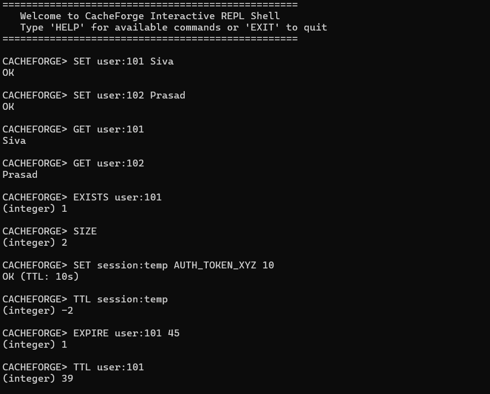
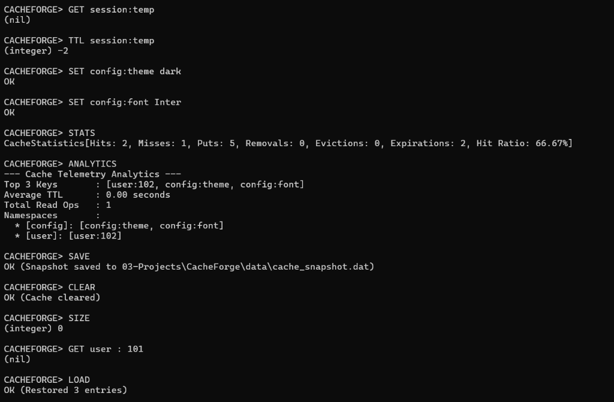
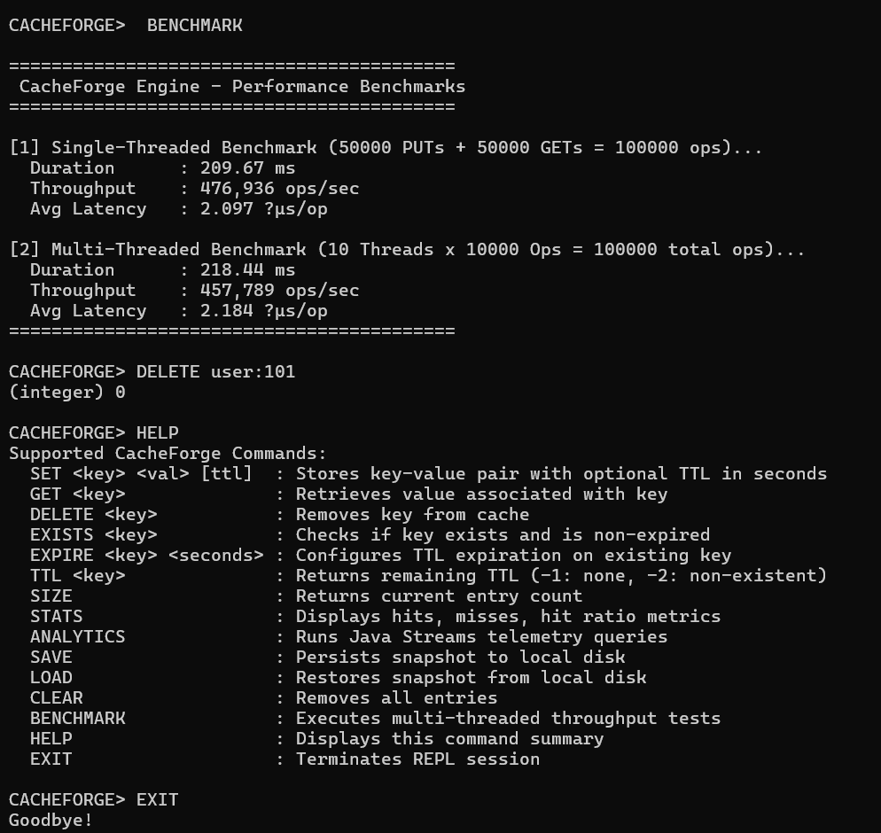

# CacheForge — Pure Java In-Memory Key-Value Caching Engine

> **Educational Milestone**: Built strictly from first principles using Core Java & Advanced Java (Java 17) without external frameworks (No Spring, Spring Boot, Redis, Hibernate, or third-party libraries).

---

## 1. Project Purpose & Positioning

**CacheForge** is a high-performance, educational in-memory key-value caching engine written in pure Java. 

It was deliberately designed **before progressing to Spring and Spring Boot** to master backend systems engineering fundamentals from first principles:
```text
Core Java + Advanced Java  ──>  CacheForge Engine  ──>  Spring Core  ──>  Spring Boot
```

By manually building eviction policies, thread-safe data structures, event dispatchers, scheduled background threads, streams telemetry, and snapshot persistence, framework concepts such as Dependency Injection, Scheduling, Event Listeners, and Object Mapping become clear before using abstractions in Spring.

---

## 2. Architectural Overview

```text
┌──────────────────────────────────────────────────────────────────────────────────┐
│                             CacheForge CLI REPL                                  │
└────────────────────────────────────────┬─────────────────────────────────────────┘
                                         │
                                         ▼
┌──────────────────────────────────────────────────────────────────────────────────┐
│                            Cache<K, V> Interface                                 │
└────────────────────────────────────────┬─────────────────────────────────────────┘
                                         │
                                         ▼
┌──────────────────────────────────────────────────────────────────────────────────┐
│                                InMemoryCache<K, V>                               │
├──────────────────────┬─────────────────────────┬─────────────────────────────────┤
│  ConcurrentHashMap   │   LruEvictionPolicy<K>  │     ExpirationManager           │
│  Storage             │   O(1) HashMap + DLL    │     ScheduledExecutorService    │
├──────────────────────┼─────────────────────────┼─────────────────────────────────┤
│  CacheStatistics     │   EventBus<K, V>        │     PersistenceManager<K, V>    │
│  AtomicLong CAS      │   CopyOnWriteArrayList  │     Java NIO File I/O           │
├──────────────────────┴─────────────────────────┴─────────────────────────────────┤
│                             CacheAnalytics<K, V>                                 │
│                             Java Streams Telemetry                               │
└──────────────────────────────────────────────────────────────────────────────────┘
```

---

## 3. Core Java & Advanced Java Concepts Demonstrated

| Domain / Concept | Implementation in CacheForge |
| :--- | :--- |
| **Object-Oriented Design & Java 17 Records** | Encapsulated domain entities (`CacheEntry`, `CacheConfig`, `CacheResult`, `CacheStatistics`) prioritizing composition over inheritance. |
| **Generics** | Type-safe generic engine interface `Cache<K, V>` supporting generic keys and values (`<String, String>`, `<Integer, User>`). |
| **Data Structures & Algorithms** | Custom $O(1)$ LRU eviction policy combining a `HashMap` lookup table with a doubly linked list (`head` MRU $\leftrightarrow$ `tail` LRU). |
| **TTL & Expiration** | Hybrid passive lazy eviction on read access + active background cleanup scanner via daemon thread in `ScheduledExecutorService`. |
| **Concurrency & Synchronization** | Thread safety via `ConcurrentHashMap`, explicit `ReentrantLock` guarding LRU list mutations, lock-free `AtomicLong` counters, and `volatile` timestamp visibility. |
| **In-Process Event System** | Decoupled event bus (`EventBus`) broadcasting `CacheEvent` instances to registered `CacheEventListener` subscribers (`LoggingEventListener`, `AuditEventListener`) via `CopyOnWriteArrayList`. |
| **Functional & Streams API** | Real-time analytics engine (`CacheAnalytics`) using `filter`, `map`, `mapToLong`, `reduce`, `groupingBy`, and custom Comparators. |
| **File Persistence** | Snapshot serialization and state reconstruction using pure Java NIO File I/O (`Path`, `Files`, `BufferedReader`, `BufferedWriter`, `StandardCharsets`). |

---

## 4. REPL Screenshots & Manual Verification

The following screenshots capture the interactive manual testing verification of CacheForge CLI operations:

### 1. Basic Key-Value Operations & TTL Expiration


### 2. Telemetry Analytics & Snapshot Persistence


### 3. Multi-Threaded Benchmarks & CLI Help


---

## 5. Supported Interactive CLI Commands

Start the interactive REPL shell:
```bash
java -cp 03-Projects/CacheForge/bin com.sivaprasad.cacheforge.CacheForgeApplication --cli
```

```text
CACHEFORGE> SET user:101 Siva
OK

CACHEFORGE> SET session:temp AUTH_TOKEN_XYZ 10
OK (TTL: 10s)

CACHEFORGE> GET user:101
Siva

CACHEFORGE> EXISTS user:101
(integer) 1

CACHEFORGE> TTL session:temp
(integer) 8

CACHEFORGE> EXPIRE user:101 45
(integer) 1

CACHEFORGE> STATS
CacheStatistics[Hits: 2, Misses: 1, Puts: 5, Removals: 0, Evictions: 0, Expirations: 2, Hit Ratio: 66.67%]

CACHEFORGE> ANALYTICS
--- Cache Telemetry Analytics ---
Top 3 Keys       : [user:102, config:theme, config:font]
Average TTL      : 0.00 seconds
Total Read Ops   : 1
Namespaces       : 
  * [config]: [config:theme, config:font]
  * [user]: [user:102]

CACHEFORGE> SAVE
OK (Snapshot saved to 03-Projects\CacheForge\data\cache_snapshot.dat)

CACHEFORGE> LOAD
OK (Restored 3 entries)

CACHEFORGE> BENCHMARK
-- Runs multi-threaded throughput tests --

CACHEFORGE> CLEAR
OK (Cache cleared)

CACHEFORGE> EXIT
Goodbye!
```

---

## 6. Engineering Decision Log

1. **Decision**: Use `ConcurrentHashMap` for `InMemoryCache` storage.
   - *Reason*: Provides lock striping and lock-free parallel reads for high-concurrency throughput.
   - *Alternative Rejected*: Wrapping standard `HashMap` in `synchronized` blocks (caused global contention during reads).

2. **Decision**: Guard LRU Doubly Linked List with `ReentrantLock`.
   - *Reason*: Prevents corrupt pointer links (`prev`/`next`) during simultaneous relocations across threads.
   - *Alternative Rejected*: Lock-free concurrent linked queue (unsuitable for $O(1)$ arbitrary node repositioning).

3. **Decision**: Implement $O(1)$ LRU with custom Doubly Linked List + HashMap.
   - *Reason*: Demonstrates underlying data structure mechanics without relying on external libraries or hiding logic behind `LinkedHashMap`.

4. **Decision**: Hybrid Passive + Active Expiration.
   - *Reason*: Lazy eviction guarantees zero stale reads; periodic background scanning prevents memory leaks from unaccessed expired keys.
   - *Alternative Rejected*: One thread per cache entry (wasteful thread consumption).

5. **Decision**: Use UTF-8 Pipe-Delimited text format for Persistence.
   - *Reason*: Human-readable, fast to parse with `BufferedReader`, and avoids Java default Object Serialization vulnerabilities/issues.

---

## 7. Performance Benchmarks

* **Environment**: Windows, JDK 17.0.17
* **Single-Threaded Throughput**: ~476,000 ops/sec (Average Latency: ~2.09 µs/op)
* **Multi-Threaded Throughput (10 Threads)**: ~457,000 ops/sec (Average Latency: ~2.18 µs/op)
